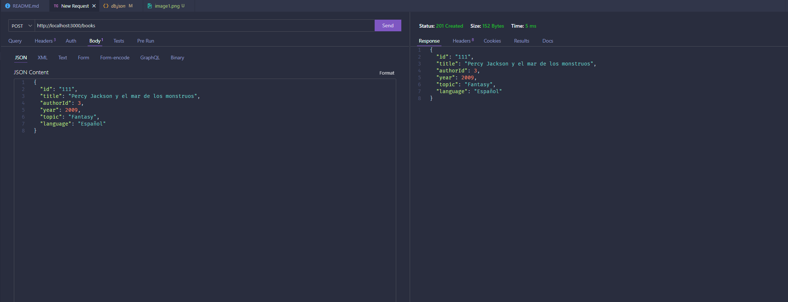

# Tarea Api 

## Ejercicio 1 checklist

    -[X] Petición GET
    -[X] Petición POST
    -[X] Petición PUT
    -[X] Petición PATCH
    -[X] Petición DELETE
    -[X] Script de CRUD con curl llamado peticiones_http.sh

## Ejercicio 2 checklist

    -[X] Crear entrada en el package.json para lanzar peticiones_http.sh

## Fotos ejercicio 1

1. Petición GET
   

2. Petición POST
   

3. Petición PUT
   

4. Petición PATCH
   

5. Petición DELETE
   