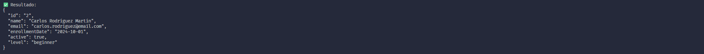
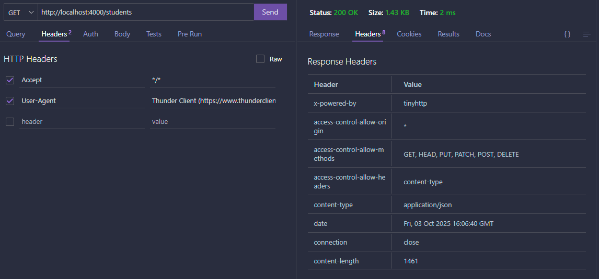

[@author Iván Balderas Carmona]: #

# <center>Manual http</center>

## Pasos previos:

1. Hacer un clonado del repositorio con el comando: 
    ```bash
    git clone (URL_REPOSITORIO)
    ```
2. Descargar las dependencias del proyecto: 
    ```bash
    npm install
    ```
3. Declarar las variables de entorno. 
    1. Ir a al archivo `.env.example` y copiar las variables. 
    2. Crear un archivo `.env` y pegar estas variables y asignarles un valor real.

4. Renovar la carpeta db.json
    1. Ir a la carpeta `db` y entrar a la subcarpeta `backup`
    2. Copiar la información del archivo `db.json` y pegarlo en el archivo de la carpeta superior para asegurarse de tener la carpeta original y no haber modificaciones de comandos usados anteriormente.

## Operaciones CRUD
1. Comando para crear un nuevo estudiante (Operación CREATE)
    - Este comando realiza la operacion POST con curl para agregar a un estudiante pasado por parametro.
    - Comando:  
        ```bash
        curl -X POST http://localhost:4000/students -H "Content-Type: application/json" -d '{"id":8,"name":"Ivan Balderas Carmona","email":"ivanbalderas@gmail.com","enrollmentDate":"2024-03-08","active":false,"level":"ad
        vanced"}'
        ```
    - Que hace cada parte del comando:
      - -i Esta parte muestra toda la información de los headers de la respuesta http.
      - -X Esta parte se usa para especificar que método vas a usar para realizar la solicitud http (POST).
      - -H Esta parte se usa para enviar HEADERS que es información adicional para la solicitud http que se hace (indicamos que es json con el header Content-Type).
      - -d Esta parte sirve para enviar datos en el cuerpo de la solicitud http (datos del nuevo estudiante).
      - Se usa el método HTTP porque define la acción que quieres realizar sobre un recurso en un servidor
      - Explicación del código de estado http recibido:
        - 201: Esto signifiva que la solicitud fue exitosa.
        - Created: Describe el código 201
        - 1º Header: Indica sobre que servidor o framework está manejando la solicitud.
        - 2º Header: Indica que permite que cualquier dominio haga solicitudes a esta API.
        - 3º Header: Indica la lista los métodos http permitidos por la API.
        - 4º Header: Indica qué headers personalizados puede enviar el cliente.
        - 5º Header: Indica el tipo del cuepo de la respuesta.
        - 6º Header: Indica la fecha y hora en que se generó la respuesta.
        - 7º Header: Indica que mantiene la conexion para poder realizar más solicitudes durante 5 segundos.
        - 8º Header: Indica el tamaño del cuerpo de la respuesta en bytes.
        - Texto entre llaves: Este es el cuerpo de la respuesta (estudiante creado).

2. Comando para leer todos los estudiantes (Operación READ ALL)
    - Este comando realiza la operacion GET con curl para mostrar todos los estudiantes.
    - Comando:  
        ```bash
        curl -i -X GET http://localhost:4000/students
        ```
    - Que hace cada parte del comando:
      - -i Esta parte muestra toda la información de los headers de la respuesta http.
      - -X Esta parte se usa para especificar que método vas a usar para realizar la solicitud http (GET).
      - Se usa el método HTTP porque define la acción que quieres realizar sobre un recurso en un servidor
      - Explicación del código de estado http recibido:
        - 200: Esto signifiva que la solicitud fue exitosa y se devolvieron los datos pedidos.
        - OK: Describe el código 200
        - 1º Header: Indica sobre que servidor o framework está manejando la solicitud.
        - 2º Header: Indica que permite que cualquier dominio haga solicitudes a esta API.
        - 3º Header: Indica la lista los métodos http permitidos por la API.
        - 4º Header: Indica qué headers personalizados puede enviar el cliente.
        - 5º Header: Indica el tipo del cuepo de la respuesta.
        - 6º Header: Indica la fecha y hora en que se generó la respuesta.
        - 7º Header: Indica que mantiene la conexion para poder realizar más solicitudes durante 5 segundos.
        - 8º Header: Indica el tamaño del cuerpo de la respuesta en bytes.
        - Texto entre llaves: Este es el cuerpo de la respuesta (todos los estudiantes).

3. Comando para leer un estudiante (Operación READ BY ID)
    - Este comando realiza la operacion GET con curl para mostrar el estudiante cuyo id es pasado como parámetro.
    - Comando:  
        ```bash
        curl -i -X GET http://localhost:4000/students/5
        ```
    - Que hace cada parte del comando:
      - -i Esta parte muestra toda la información de los headers de la respuesta http.
      - -X Esta parte se usa para especificar que método vas a usar para realizar la solicitud http (GET).
      - Se usa el método HTTP porque define la acción que quieres realizar sobre un recurso en un servidor
      - Explicación del código de estado http recibido:
        - 200: Esto signifiva que la solicitud fue exitosa y se devolvieron los datos pedidos.
        - OK: Describe el código 200
        - 1º Header: Indica sobre que servidor o framework está manejando la solicitud.
        - 2º Header: Indica que permite que cualquier dominio haga solicitudes a esta API.
        - 3º Header: Indica la lista los métodos http permitidos por la API.
        - 4º Header: Indica qué headers personalizados puede enviar el cliente.
        - 5º Header: Indica el tipo del cuepo de la respuesta.
        - 6º Header: Indica la fecha y hora en que se generó la respuesta.
        - 7º Header: Indica que mantiene la conexion para poder realizar más solicitudes durante 5 segundos.
        - 8º Header: Indica el tamaño del cuerpo de la respuesta en bytes.
        - Texto entre llaves: Este es el cuerpo de la respuesta (estudiante con el id pasado).

4. Comando para actualizar un estudiante (Operación UPDATE)
    - Este comando realiza la operacion PUT con curl para modificar completamente al alumno cuyo id y nueva información se han pasado como parámetros.
    - Comando:  
        ```bash
        curl -i -X PUT http://localhost:4000/students/4 -H "Content-Type: application/json" -d '{"id":2,"name":"Juan Lopez Lopez","email":"juan.lopez@gmail.com","enrollmentDate":"2024-01-16","active":false,"level":"intermediate"}'
        ```
    - Que hace cada parte del comando:
      - -i Esta parte muestra toda la información de los headers de la respuesta http.
      - -X Esta parte se usa para especificar que método vas a usar para realizar la solicitud http (PUT).
      - -H Esta parte se usa para enviar HEADERS que es información adicional para la solicitud http que se hace (indicamos que es json con el header Content-Type).
      - -d Esta parte sirve para enviar datos en el cuerpo de la solicitud http (datos actualizados del estudiante).
      - Se usa el método HTTP porque define la acción que quieres realizar sobre un recurso en un servidor
      - Explicación del código de estado http recibido:
        - 200: Esto signifiva que la solicitud fue exitosa y se devolvieron los datos pedidos.
        - OK: Describe el código 200
        - 1º Header: Indica sobre que servidor o framework está manejando la solicitud.
        - 2º Header: Indica que permite que cualquier dominio haga solicitudes a esta API.
        - 3º Header: Indica la lista los métodos http permitidos por la API.
        - 4º Header: Indica qué headers personalizados puede enviar el cliente.
        - 5º Header: Indica el tipo del cuepo de la respuesta.
        - 6º Header: Indica la fecha y hora en que se generó la respuesta.
        - 7º Header: Indica que mantiene la conexion para poder realizar más solicitudes durante 5 segundos.
        - 8º Header: Indica el tamaño del cuerpo de la respuesta en bytes.
        - Texto entre llaves: Este es el cuerpo de la respuesta (nuevos datos del estudiante).

5. Comando para actualizar parcialmente un estudiante (Operación PATCH)
    - Este comando realiza la operacion PATCH con curl para modificar parcialmente al alumno cuyo id y nueva información se han pasado como parámetros.
    - Comando:  
        ```bash
        curl -i -X PATCH http://localhost:4000/students/7 -H "Content-Type: application/json" -d '{"active":true}'
        ```
    - Que hace cada parte del comando:
      - -i Esta parte muestra toda la información de los headers de la respuesta http.
      - -X Esta parte se usa para especificar que método vas a usar para realizar la solicitud http (PATCH).
      - -H Esta parte se usa para enviar HEADERS que es información adicional para la solicitud http que se hace (indicamos que es json con el header Content-Type).
      - -d Esta parte sirve para enviar datos en el cuerpo de la solicitud http (datos parciales a actualizar en el estudiante).
      - Se usa el método HTTP porque define la acción que quieres realizar sobre un recurso en un servidor
      - Explicación del código de estado http recibido:
        - 200: Esto signifiva que la solicitud fue exitosa y se devolvieron los datos pedidos.
        - OK: Describe el código 200
        - 1º Header: Indica sobre que servidor o framework está manejando la solicitud.
        - 2º Header: Indica que permite que cualquier dominio haga solicitudes a esta API.
        - 3º Header: Indica la lista los métodos http permitidos por la API.
        - 4º Header: Indica qué headers personalizados puede enviar el cliente.
        - 5º Header: Indica el tipo del cuepo de la respuesta.
        - 6º Header: Indica la fecha y hora en que se generó la respuesta.
        - 7º Header: Indica que mantiene la conexion para poder realizar más solicitudes durante 5 segundos.
        - 8º Header: Indica el tamaño del cuerpo de la respuesta en bytes.
        - Texto entre llaves: Este es el cuerpo de la respuesta (nuevos datos actualizados del estudiante).

6. Comando para actualizar parcialmente un estudiante (Operación DELETE)
    - Este comando realiza la operacion DELETE con curl para eliminar al alumno cuyo id es pasado como parámetro.
    - Comando:  
        ```bash
        curl -i -X DELETE http://localhost:4000/students/3
        ```
    - Que hace cada parte del comando:
      - -i Esta parte muestra toda la información de los headers de la respuesta http.
      - -X Esta parte se usa para especificar que método vas a usar para realizar la solicitud http (DELETE).
      - Se usa el método HTTP porque define la acción que quieres realizar sobre un recurso en un servidor
      - Explicación del código de estado http recibido:
        - 200: Esto signifiva que la solicitud fue exitosa y se devolvieron los datos pedidos.
        - OK: Describe el código 200
        - 1º Header: Indica sobre que servidor o framework está manejando la solicitud.
        - 2º Header: Indica que permite que cualquier dominio haga solicitudes a esta API.
        - 3º Header: Indica la lista los métodos http permitidos por la API.
        - 4º Header: Indica qué headers personalizados puede enviar el cliente.
        - 5º Header: Indica el tipo del cuepo de la respuesta.
        - 6º Header: Indica la fecha y hora en que se generó la respuesta.
        - 7º Header: Indica que mantiene la conexion para poder realizar más solicitudes durante 5 segundos.
        - 8º Header: Indica el tamaño del cuerpo de la respuesta en bytes.
        - Texto entre llaves: Este es el cuerpo de la respuesta (datos del estudiante eliminado).

7. Pruebas reales 
   
    
    
    

## Operaciones CRUD con Thunder Client

1. Como se usa Thunder Client
   - Para usar Thunder client hay que instalarse la extensión de Thunder Client que tiene mas de 6 millones de descargas y esta hecha por Thunder Client.
   - Una vez instalada la extensión, debería aparezer en la misma barra lateral de las extensiones, un icóno de un circulo con un razo dentro, se pulsa ahi y se abrirá el Thunder Client.
   - Para usarlo solo hay que darle al boton de arriba en new request para crear tu primera request.
   - Te aparecerá un desplegable con las opciones de las peticiones, por defecto esta puesto GET, a la derecha de ese despliegue, se escribe el http o el https de tu url.
   - Debajo, estan las opciones para añadir información a la request, como los header y el body.

2. Operación POST
   1. Esta operación realiza la petición POST del CRUD para añadir un alumno nuevo a students.
       
       
   2. Esta operación realiza la petición GET del CRUD donde se leen todos los estudiantes que existen.
       
       
   3. Esta operación realiza la petición GET del CRUD donde se lee un solo estudiante
       
       
   4. Esta operación realiza la petición PUT que modifica por completo la informacion de un estudiante.
       
       
   5. Esta operación realiza la petición PATCH que modifica parcialmente la información de un estudiante.
       
       
   6. Esta operación realiza la petición DELETE que elimina a un alumno.
       
       

## Operaciones con REST Client

    1. La petición que se esta mostrando es la petición que tiene el botón de Send Request en azul:


## Script de validación
 